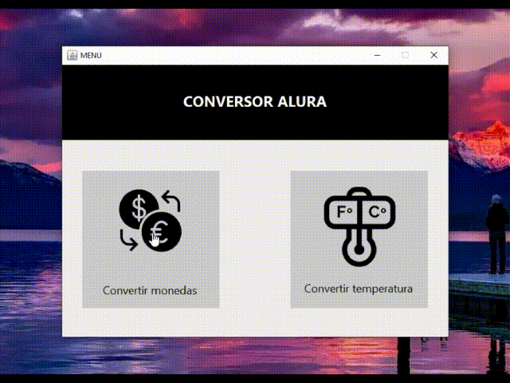

# Conversor de Moneda - Challenge ONE Java

Este proyecto es un conversor de temperatura y monedas desarrollado en Java.

## Cómo usar el conversor

1. Clonar el repositorio en tu máquina local usando el siguiente comando:

```
git clone https://github.com/Junior-HJ/ConversorAlura
```

2. Abre el proyecto en tu IDE favorito, como NetBeans.

3. Ejecuta el proyecto.

4. Para utilizar el conversor de moneda, selecciona las unidades de moneda de origen y destino en los menús desplegables correspondientes.

5. Ingresa la cantidad de moneda en el campo de texto y haz clic en el botón "Convertir". La aplicación calculará y mostrará la conversión en tiempo real.

6. Para utilizar el conversor de temperatura, ingresa el valor de temperatura en el campo de texto correspondiente a la unidad que desees convertir (Celsius, Fahrenheit, Kelvin o Rankine). Las conversiones se realizarán automáticamente mientras ingresas el valor.

> Captura de pantalla de la aplicación en ejecución.



**Dame una ⭐ si te gusta este proyecto😜!**
## Funcionalidades

- **Conversor de Moneda:** Permite convertir entre diversas unidades de moneda, incluyendo Dólar, Euro, Peso argentino, Peso chileno, Peso colombiano, Peso mexicano, Peso uruguayo, Real brasileño, Sol Peruano y Yen japonés. Además, utiliza la API de [exchangerate.host](https://exchangerate.host/) para obtener tasas de cambio actualizadas de más de 170 monedas.

- **Conversor de Temperatura:** Permite convertir entre las unidades de temperatura: Celsius, Fahrenheit, Kelvin y Rankine.

- **Actualización en Tiempo Real:** Las conversiones de moneda se actualizan automáticamente utilizando tasas de cambio en tiempo real.

- **Redondeo a Dos Decimales:** Los resultados de las conversiones se muestran con dos decimales para una mejor legibilidad.

## Tecnologías Utilizadas

- Java
- Swing (para la interfaz gráfica)

## Contribuciones

Si deseas contribuir a este proyecto, por favor envía un pull request. Estaré encantado de revisarlo y fusionarlo si es apropiado.

## Licencia © [Junior-HJ](https://www.linkedin.com/in/shilariojara/)

Este proyecto está bajo la Licencia Apache 2.0. Revisa el [LICENSE](LICENSE) para más detalles.
